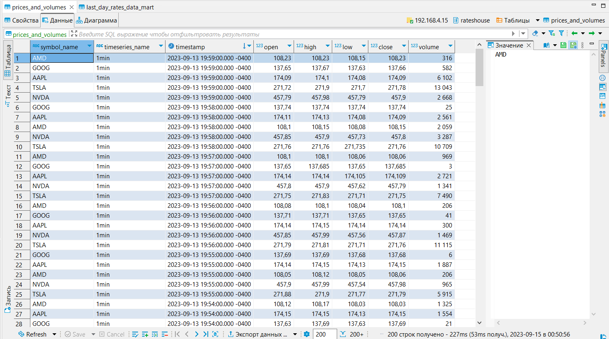
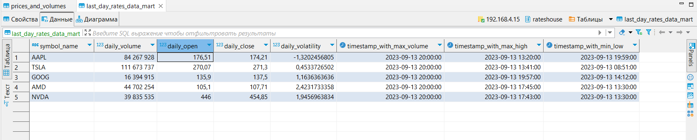
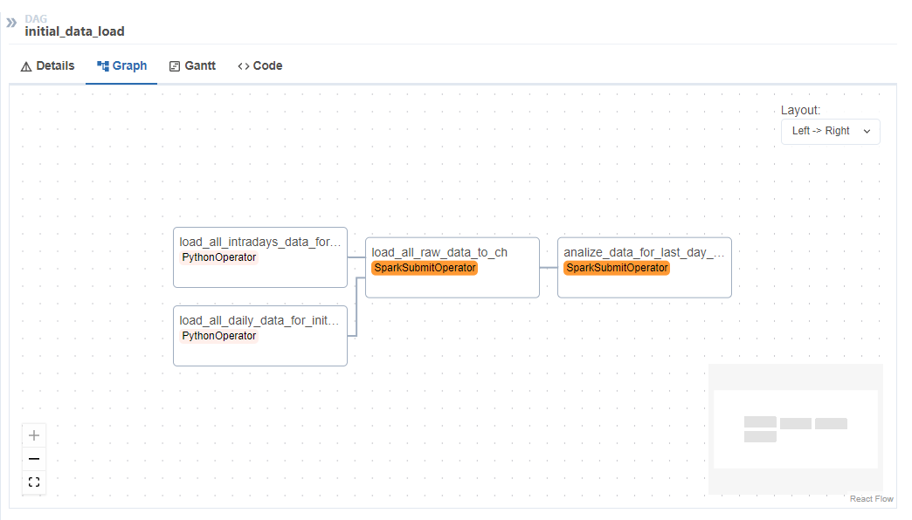
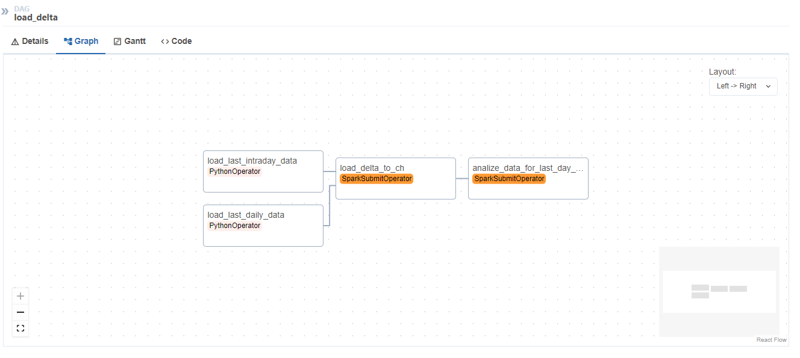
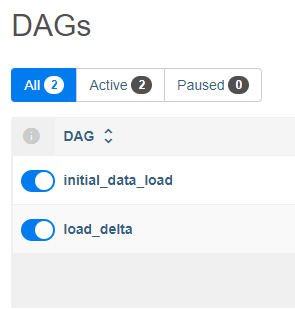
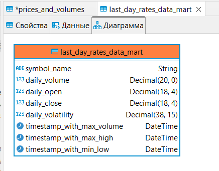

# Currency-market-analysis-1T-DATA
**Проект по созданию ETL-процесса формирования витрин данных для анализа изменений курса валют из источника https://www.alphavantage.co**

Полное описание задачи находится в файле [project_task.md](./docs/project_task.md)

## Начало работы

Для начала работы необходимо склонировать репозиторий на свою машину:
```
git clone https://github.com/AinKub/Currency-market-analysis-1T-DATA.git
```

Затем нужно перейти в папку проекта, переименовать `.env.example` в `.env`
```
cd Currency-market-analysis-1T-DATA
mv .env.example .env
```

В `.env` изменить `ALPHA_VANTAGE_API_KEYS` на свой (Получить его можно по этому адресу: https://www.alphavantage.co/support/#api-key)
Т.к. инициализирующий скрипт собирает данные за последние полгода, а в день доступно максимум 100 запросов + можно сделать только 5 запросов в минуту, то рекомендуется ипользовать премиум подписку (Но можно и создать несколько ключей, чего автор проекта не одобряет, но в качестве единовременного эксперимента можно попробовать)

Перейти в директорию `docker-clickhouse-airflow-with-spark` и запустить контейнеры
```
cd ./docker-clickhouse-airflow-with-spark
docker build -t airflow-with-java .
docker compose up
```
airflow-with-java требуется, чтобы не возникало проблем с переменной окружения `JAVA_HOME` для работы `SparkSubmitOperator`

После сборки станут доступны следующие адреса:
1) Airflow - http://localhost:8080/

Для работы проекта необходимо инициализировать в Airflow следующие переменные:
- **init_symbols**, являющаяся списком всех тикеров, которые будут отслеживаться
- **alpha_vantage_api_keys**, т.е. апи ключи, полученные ранее и добавленные в .env
- **alpha_vantage_query_url**, т.е. адрес Alpha Vantage, куда будут посылаться запросы

А также нужно инициализировать в Airflow следующие подключения:
- **spark_default**, для работы `SparkSubmitOperator`

Сделать это можно с помощью скрипта в директории `src` [load_airflow_variables_and_connection.py](./src/load_airflow_variables_and_connection.py), но предварительно настроив окружение
```
cd ..  # Если находитесь в директории docker-clickhouse-airflow-with-spark
python3 -m venv venv

source venv/bin/activate   # Если ОС Linux
venv\scripts\activate.bat  # Для Windows 

pip install -r requirements.txt

python3 src/load_airflow_variables_and_connection.py
```

После этого в консоли можно увидеть следующее сообщение:
<br></br>


А в Airflow по адресу http://localhost:8080/variable/list/ должны появиться добавленные скриптом переменные. А подключения здесь - http://localhost:8080/connection/list/

После всех проделанных шагов нужно активировать даг `initial_data_load` и дождаться его выполнения. Он делает следующее:
1) Парсит данные с https://www.alphavantage.co, меняя ключи и ожидая, когда лимит в запросов в минуту восстановится, сохраняет данные в csv файлы в директорию вида `дата_парсинга/имя_тикера/таймфрейм`. В данном проекте реализован парсинг данных внутри для за каждую минуту и парсинг общих данных за день. Общие данные загружаются полностью (вплоть до 1999 года), а внутри дня за прошедшие полгода.
2) Обрабатывает данные (обрезает общие данные до самой первой даты внутри дня), соединяет их и загружает в Clickhouse

3) Строит/перестраивает витрину, данную в задании



После инициализации можно убедиться в наличии данных в базе данных (доступна по порту 8123). И после этого можно активировать даг `load_delta`, который делает то же, что и инициализирущий, но со следующими отличиями:
1) Собирает общие данные в компактном виде (100 последних записи)
2) Собирает внутридневные данные за последний месяц
3) Пишет в базу только данные за предыдущий день (обрезая всё остальное)





## Шаги реализации

### Проектирование DWH

На начальном этапе была поставлена задача спроектировать DHW, его логическую структуру, от которой впоследующем можно было бы отталкиваться в выборе инструментов для организации ETL процесса.

Данный сайт, https://www.alphavantage.co, предоставляет следующие данные:
- Цены (открытия, закрытия, самые высокие, низкие) и обьёмы торгов через определенные интервалы времени внутри дня конкретного тикера, например:
```
{
    "Meta Data": {
        "1. Information": "Intraday (5min) open, high, low, close prices and volume",
        "2. Symbol": "tsla",
        "3. Last Refreshed": "2023-09-01 19:55:00",
        "4. Interval": "5min",
        "5. Output Size": "Compact",
        "6. Time Zone": "US/Eastern"
    },
    "Time Series (5min)": {
        "2023-09-01 19:55:00": {
            "1. open": "245.4600",
            "2. high": "245.5000",
            "3. low": "245.1000",
            "4. close": "245.2500",
            "5. volume": "29318"
        },
        # 19.50, 19.45 и т.д. до открытия торгов
    }
}
```
- Цены (открытия, закрытия, самые высокие, низкие) и обьёмы торгов за определенный день. Здесь указывается самая высокая цена за день
```
{
    "Meta Data": {
        "1. Information": "Daily Prices (open, high, low, close) and Volumes",
        "2. Symbol": "IBM",
        "3. Last Refreshed": "2023-09-01",
        "4. Output Size": "Full size",
        "5. Time Zone": "US/Eastern"
    },
    "Time Series (Daily)": {
        "2023-09-01": {
            "1. open": "147.2600",
            "2. high": "148.1000",
            "3. low": "146.9200",
            "4. close": "147.9400",
            "5. volume": "2727796"
        },
        # 31.08, 30.08 и т.д.
    }
}
```
Данные можно получить или в формате json, как показано выше, или в формате csv. Выбор сделан в пользу формата csv, т.к. предоставляемые данные легче читать с помощью spark именно в этом формате.

Итоговая витрина, которая должна была быть сформирована, включает в себя следующие поля:
1) Суррогатный ключ валюты
2) Название валюты
3) Суммарный объем торгов за последние сутки
4) Курс валюты на момент открытия торгов для данных суток
5) Курс валюты на момент закрытия торгов для данных суток
6) Разница (в %) курса с момента открытия до момента закрытия торгов для данных суток
7) Минимальный временной интервал, на котором был зафиксирован самый крупный объем торгов для данных суток
8) Минимальный временной интервал, на котором был зафиксирован максимальный курс для данных суток
9) Минимальный временной интервал, на котором был зафиксирован минимальный курс торгов для данных суток

В итоге был сделан вывод, что поля 3, 4, 5, 6 могут быть сформированы из цен и объемов за день, а 7, 8, 9 из более подробной информации об этом дне, т.е. из интервалов этого дня.

В `Core` слое была определена таблица `Prices_and_volumes`, содержащая имя тикера, имя таймфрейма, дату и время, цену открытия, закрытия, самую высокую цену, низкую и объем, т.е. собирающая в себя всю информацию по торгам и позволяющая идентифицировать запись по имени тикера, таймфрейма и по дате и времени.
<br></br>
Диаграмму слоёв DWH (или КХД) можно увидеть на рисунке ниже:
<br></br>


Или здесь, более детально, в <a href="https://www.figma.com/file/TXW9UYVSf5HJ4RP1hxuNnY/Stock-market-analizing-DWH?type=design&node-id=0%3A1&mode=design&t=FP0pZhkhRQ7HmK8z-1">файле Figma</a> 


### Физическая реализация DWH

В качестве СУБД был выбран ClickHouse - СУБД от компании Яндекс. Это колоночная база данных, одним из преимуществ которой является очень высокая скорость чтения. Т.к. записей по торгам очень много, это являлось ключевым фактором в принятии решения о выборе данной СУБД.
В силу того, что в ClickHouse очень сложно реализовать создание первичных ключей - автоинкрементов, а использование uuid было не к месту, было принято решение оставить одну таблицу в Core слое (ранее структура содержала в себе таблицы `Symbols`, `Timeseries`, `Prices_and_volumes` и главную таблицу фактов `Stock_data`). Ниже приведена схема таблицы `Prices_and_volumes`:
<br></br>


Движок используется MergeTree, первичного ключа нет, сортировка по тикеру, таймфрейму и дате и времени. Партицирование осуществляется по месяцам.

Витрина также использует движок MergeTree и создаётся/пересоздается с помощью pyspark.
Итоговая витрина содержит в себе все поля, которые были указаны выше, за исключением суррогатного ключа валюты.
<br></br>



### Структура проекта

Проект устроен следующим образом:

В `docker-clickhouse-airflow-with-spark` находятся файлы, необходимые для запуска airflow, clickhouse (вместе с ddl скриптом), а также там находится том `raw_layer_data`, в котором находятся все raw файлы.

`src` содержит в себе даги, вспомогательные скрипты airflow и скрипты spark. Также здесь находится скрипт для загрузки переменных и подключения к spark в airflow variables и connections.


### Загрузка (Extract) данных

Для извлечения данных через api, предоставляемое https://www.alphavantage.co, был написал модуль [stock_data_loader.py](./src/airflow_scripts/stock_data_loader.py), который делает запрос к api и получает оттуда данные в формате csv. Полученные данные он записывает в csv файлы в папку raw_layer_data, которая лежит в директории `docker-clickhouse-airflow-with-spark`


### Преобразование (Transform) и загрузка (Load) данных

В зависимости от сценария (инициализация или добавление дельты данных) данные преобразовыватся немного по-разному. При инициализации данные общие обрезаются под данные внутридневные, т.к. общие данные загружаются вплоть до 1999 года, а внутридневные - за последние полгода (из-за ограничений API). Затем эти данные сливаются и загружаются в clickhouse.

При добавлении дельты данных уже не нужно загружать большое количество данных, поэтому и общие, и внутредневные данные обрезаются по предыдущему дню, затем сливаются и загружаются в clickhouse.

В качестве оркестратора выбран Airflow из-за удобства использования, а также из-за бОльшего опыта работы обучающегося с ним, нежели с другими оркестраторами.

Все данные обрабатываются, пишутся и читаются с помощью pyspark.


## Результаты работы

Таким образом, была достигнута задача создания ETL-процесса формирования витрин данных для анализа изменений курса валют.
Было разработано два режима загрузки данных: 
- Инициализирующий — загрузка полного слепка данных источника
- Инкрементальный — загрузка дельты данных за прошедшие сутки

Организована структура, состоящего из слоя сырых данных, промежуточного слоя и слоя витрин, а также настроено формирование витрины с изменениями курсов валют за предыдущий день.