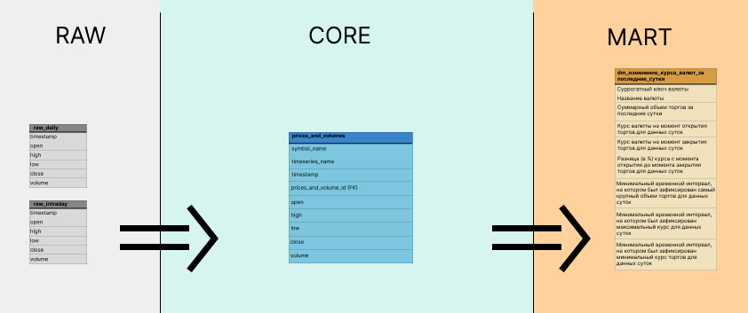

# Currency-market-analysis-1T-DATA
**Проект по созданию ETL-процесса формирования витрин данных для анализа изменений курса валют из источника https://www.alphavantage.co**

Полное описание задачи находится в файле [project_task.md](./docs/project_task.md)

## Начало работы

Для начала работы необходимо склонировать репозиторий на свою машину:
```
git clone https://github.com/AinKub/Currency-market-analysis-1T-DATA.git
```

Затем нужно перейти в папку проекта, переименовать `.env.example` в `.env`
```
cd Currency-market-analysis-1T-DATA
mv .env.example .env
```

В `.env` изменить `ALPHA_VANTAGE_API_KEY` на свой (Получить его можно по этому адресу: https://www.alphavantage.co/support/#api-key)

Перейти в директорию `docker-hadoop-spark-airflow` и запустить контейнеры
```
cd ./docker-hadoop-spark-airflow
docker compose up
```

После сборки станут доступны следующие адреса:
1) Airflow - http://localhost:8079/
2) Namenode - http://localhost:9870/dfshealth.html#tab-overview
3) Datanode1 - http://localhost:9864/datanode.html
4) Resourcemanager - http://localhost:8087/cluster/
5) Nodemanager1 - http://localhost:8042/node/
6) Historyserver - http://localhost:8188/applicationhistory/
7) Spark-master - http://localhost:8080/
8) Spark-worker-1 - http://localhost:8081/
8) Spark-worker-2 - http://localhost:8082/
9) Hue - http://localhost:8888/

Для работы проекта необходимо инициализировать в Airflow следующие переменные:
- **init_symbols**, являющаяся списком всех тикеров, которые будут отслеживаться
- **alpha_vantage_api_key**, т.е. апи ключ, полученный ранее и добавленный в .env
- **alpha_vantage_query_url**, т.е. адрес Alpha Vantage, куда будут посылаться запросы

А также нужно инициализировать в Airflow следующие подключения:
- **spark_default**, для работы с контейнером Spark-master

Сделать это можно с помощью скрипта в директории `src` [load_airflow_variables_and_connection.py](./src/load_airflow_variables_and_connection.py), но предварительно настроив окружение
```
cd ..  # Если находитесь в директории docker-hadoop-spark-airflow
python3 -m venv venv

source venv/bin/activate   # Если ОС Linux
venv\scripts\activate.bat  # Для Windows 

pip install -r requirements.txt

python3 src/load_airflow_variables_and_connection.py
```

После этого в консоли можно увидеть следующее сообщение:
<br></br>


А в Airflow по адресу http://localhost:8079/variable/list/ должны появиться добавленные скриптом переменные. А подключения здесь - http://localhost:8079/connection/list/


## Шаги реализации

### Проектирование DWH

На начальном этапе была поставлена задача спроектировать DHW, его логическую структуру, от которой впоследующем можно было бы отталкиваться в выборе инструментов для организации ETL процесса.

Данный сайт, https://www.alphavantage.co, предоставляет следующие данные:
- Цены (открытия, закрытия, самые высокие, низкие) и обьёмы торгов через определенные интервалы времени внутри дня конкретного тикера, например:
```
{
    "Meta Data": {
        "1. Information": "Intraday (5min) open, high, low, close prices and volume",
        "2. Symbol": "tsla",
        "3. Last Refreshed": "2023-09-01 19:55:00",
        "4. Interval": "5min",
        "5. Output Size": "Compact",
        "6. Time Zone": "US/Eastern"
    },
    "Time Series (5min)": {
        "2023-09-01 19:55:00": {
            "1. open": "245.4600",
            "2. high": "245.5000",
            "3. low": "245.1000",
            "4. close": "245.2500",
            "5. volume": "29318"
        },
        # 19.50, 19.45 и т.д. до открытия торгов
    }
}
```
- Цены (открытия, закрытия, самые высокие, низкие) и обьёмы торгов за определенный день. Здесь указывается самая высокая цена за день
```
{
    "Meta Data": {
        "1. Information": "Daily Prices (open, high, low, close) and Volumes",
        "2. Symbol": "IBM",
        "3. Last Refreshed": "2023-09-01",
        "4. Output Size": "Full size",
        "5. Time Zone": "US/Eastern"
    },
    "Time Series (Daily)": {
        "2023-09-01": {
            "1. open": "147.2600",
            "2. high": "148.1000",
            "3. low": "146.9200",
            "4. close": "147.9400",
            "5. volume": "2727796"
        },
        # 31.08, 30.08 и т.д.
    }
}
```

Итоговая витрина, которая должна была быть сформирована, включает в себя следующие поля:
1) Суррогатный ключ валюты
2) Название валюты
3) Суммарный объем торгов за последние сутки
4) Курс валюты на момент открытия торгов для данных суток
5) Курс валюты на момент закрытия торгов для данных суток
6) Разница (в %) курса с момента открытия до момента закрытия торгов для данных суток
7) Минимальный временной интервал, на котором был зафиксирован самый крупный объем торгов для данных суток
8) Минимальный временной интервал, на котором был зафиксирован максимальный курс для данных суток
9) Минимальный временной интервал, на котором был зафиксирован минимальный курс торгов для данных суток

В итоге был сделан вывод, что поля 3, 4, 5, 6 могут быть сформированы из цен и объемов за день, а 7, 8, 9 из более подробной информации об этом дне, т.е. из интервалов этого дня.

В `Core` слое были определены таблицы `Symbol`, которая имеет суррогатный первичный ключ и имя тикера, `Timeseries`, также имеющая суррогатный ключ и название таймфрейма для того, чтобы фильтровать затем данные, `Prices_and_volumes`, содержащая цену открытия, закрытия, самую высокую цену, низкую и объем, и центральную таблицу фактов, `Stock_data`, собирающая в себя все эти таблицы, а также имеющая дату и время. Дата и время разделены в связи с тем, что общие данные за день не имеют времени, только дату, поэтому в этих случаях колонка `time` будет `Null`.
<br></br>
Диаграмму слоёв DWH (или КХД) можно увидеть на рисунке ниже:
<br></br>


Или здесь, более детально, в <a href="https://www.figma.com/file/TXW9UYVSf5HJ4RP1hxuNnY/Stock-market-analizing-DWH?type=design&node-id=0%3A1&mode=design&t=FP0pZhkhRQ7HmK8z-1">файле Figma</a> 

### Загрузка (Extract) данных

Для извлечения данных через api, предоставляемое https://www.alphavantage.co, был написал модуль [stock_data_loader.py](./src/stock_data_loader.py), который делает запрос к api и получает оттуда данные в формате csv. Полученные данные он записывает в csv файлы в папку temp_data, которая лежит рядом с данным readme.